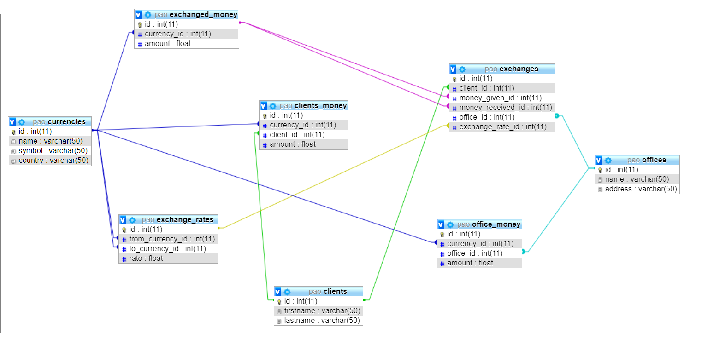

# JExchange

Currency exchange application made in `Java`, stored with `MySQL` and persisted with `Hibernate`

## About

This is a project I made for my advanced object-oriented programming (PAO) faculty class.
I had to do an exchange office that handles clients, exchanges, currencies, exchange rates, transactions and logs for all operations.

## App design

This app is build using the MVC pattern as described here: [Project Structure](https://github.com/adrianbuturuga/pao_lab/tree/master/projectStructure)

Given this design, I managed to provide two ways of data persistence, one locally, using CSV files (data is load in the memory) and the other one using a persistence JPA framework - Hibernate to store the entities/models in a MySQL database.

## Database storage

Database is generated using the `database.sql` file in the root directory.
All ORM files handled by Hibernate are located in the `src` directory. There is also JPA annotations support for all entities.

The schema for the database is:

